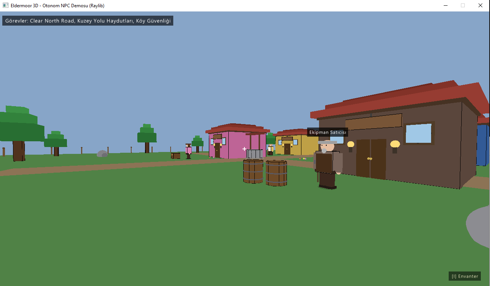
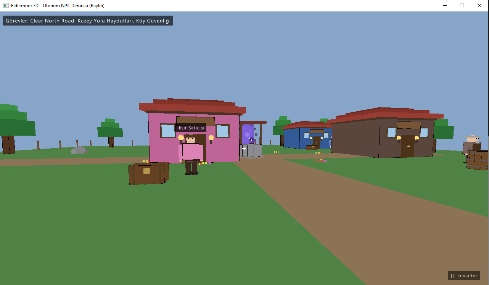

# Eldermoor 3D — LLM + Ses Tabanlı Otonom NPC Sistemi

Oyunlardaki tek düze, scripted NPC etkileşimlerine alternatif olarak; mikrofonla doğal Türkçe konuşulan, yapay zeka ile dinamik cevap üreten, sesli yanıt veren ve oyun-içi aksiyon tetikleyebilen (function calling) otonom NPC sistemi.

Bitirme projesi olarak geliştirilmiştir.





---

## Özellikler

- **Doğal Türkçe konuşma:** Whisper (medium) ile mikrofon → metin dönüşümü
- **Dinamik diyalog:** Groq + Llama 3.3 70B ile her seferinde benzersiz cevaplar
- **Sesli yanıt:** Edge TTS ile gerçek zamanlı Türkçe sesli konuşma (Ahmet, Emel)
- **Fonksiyon çağırma:** NPC'ler gerçek oyun aksiyonu tetikler (envantere eşya ekleme, görev verme, altın transferi)
- **Kalıcı durum:** Oyun state'i JSON olarak diske yazılır, sonraki açılışta korunur
- **5 farklı karakter:** Ekipman Satıcısı, İksir Satıcısı, Köy Muhafızı, Han Sahibi, Gezgin Büyücü — her biri ayrı kişilik prompt'u ile
- **3D dünya:** Raylib (pyray) ile first-person 3D köy ortamı
- **Collision detection, envanter sistemi, pause menü, Türkçe karakter desteği**

## Sistem Mimarisi

```
┌─────────────┐
│  Mikrofon   │
└──────┬──────┘
       │ ses
       ▼
┌─────────────┐
│  Whisper    │  faster-whisper (medium, CUDA)
│    (STT)    │  Türkçe optimize, oyun bağlam prompt'u
└──────┬──────┘
       │ metin
       ▼
┌─────────────┐
│   Groq      │  Llama 3.3 70B + function calling
│   (LLM)     │  Persona prompt + conversation history
└──────┬──────┘
       │ cevap + tool call
       ▼
┌─────────────┐      ┌────────────────┐
│  Edge TTS   │      │  game_state.py │
│    (TTS)    │      │  (executes     │
└──────┬──────┘      │   tool calls)  │
       │ ses          └────────────────┘
       ▼
┌─────────────┐
│   Hoparlör  │
└─────────────┘
```

**Modüler tasarım:** `npc_brain.py` (AI çekirdeği) ve `game_state.py` (oyun durumu) frontend-bağımsızdır. Aynı AI altyapısı hem 2D Pygame (`game.py`) hem 3D Raylib (`game_raylib.py`) frontend'leriyle çalışır.

## Kurulum

### Gereksinimler

- Python 3.11+
- NVIDIA GPU (önerilen, CUDA için) — CPU'da da çalışır ama yavaş
- Mikrofon
- İnternet bağlantısı (Groq ve Edge TTS bulut tabanlı)

### Adımlar

```bash
# 1. Depoyu klonla
git clone https://github.com/KULLANICI_ADI/eldermoor-3d-npc.git
cd eldermoor-3d-npc

# 2. Sanal ortam oluştur
python -m venv venv

# Windows
venv\Scripts\activate

# Linux/Mac
source venv/bin/activate

# 3. Bağımlılıkları kur
pip install -r requirements.txt

# 4. Groq API anahtarını ayarla
# .env dosyası oluştur, içine ekle:
# GROQ_API_KEY=gsk_xxxxxxxxxxxxxxxxxxxxxxx
```

[Groq API anahtarı buradan ücretsiz alınabilir.](https://console.groq.com)

### Çalıştırma

**3D versiyon (ana demo):**
```bash
python game_raylib.py
```

**2D Pygame versiyonu (yedek):**
```bash
python game.py
```

**Terminal modu (sadece sesli diyalog, görselsiz):**
```bash
python npc_chat.py
```

## Kontroller

| Tuş | İşlev |
|-----|-------|
| **WASD** | Hareket |
| **Mouse** | Bakış yönü |
| **E** | Yakındaki NPC ile konuş |
| **SPACE (basılı tut)** | Mikrofon kaydı (diyalog modunda) |
| **I** | Envanter aç/kapa |
| **ESC** | Pause menüsü (diyalog modunda: diyalogdan çık) |
| **F1** | Debug mode |
| **Q** | Çıkış |

## Karakterler

| NPC | Sattığı/Verdiği | Ses |
|-----|------|-----|
| **Ekipman Satıcısı (Gareth)** | Kılıç (50 altın), Zırh (80 altın) | tr-TR-AhmetNeural |
| **İksir Satıcısı (Mira)** | Sağlık İksiri (20), Mana İksiri (25) | tr-TR-EmelNeural |
| **Köy Muhafızı (Roderick)** | Görevler verir (haydutlar/kurtlar) | tr-TR-AhmetNeural |
| **Han Sahibi (Elara)** | Sohbet + köy dedikoduları | tr-TR-EmelNeural |
| **Gezgin Büyücü (Zephyr)** | Uzak diyarlardan bahseder | tr-TR-AhmetNeural |

## Function Calling Araçları

Llama 3.3 70B aşağıdaki araçları yapısal (structured) çağırabilir:

- `give_item(item_name, quantity, price)` — Oyuncuya eşya ver/sat
- `take_gold(amount, reason)` — Altın al
- `give_gold(amount, reason)` — Altın ver
- `check_inventory()` — Oyuncunun envanterini kontrol et
- `offer_quest(quest_id, title, description, reward_gold, giver)` — Görev sun
- `complete_quest(quest_id)` — Görev tamamla (kanıt eşyası gerekli)

## Performans Ölçümleri

NVIDIA RTX 2060 (CUDA) + Groq cloud + Edge TTS cloud ortamında ölçülen ortalama gecikme süreleri:

| Bileşen | Ortalama (ms) |
|---------|---------------|
| STT (Whisper medium) | ~300-400 |
| LLM (Groq) | ~800-900 |
| TTS (Edge) | ~400-500 |
| **Uçtan uca** | **~1600-1800** |

Detaylı ölçüm için `python benchmark.py` çalıştırılabilir.

## Dosya Yapısı

```
eldermoor-3d-npc/
├── .env                    # GROQ_API_KEY (gitignore)
├── npcs.json               # NPC tanımları (kişilik prompt'ları)
├── game_state.py           # Oyun durumu + tool fonksiyonları + tool tanımları
├── npc_brain.py            # AI çekirdeği (STT, LLM, TTS, conversation history)
├── npc_chat.py             # Terminal modu (sadece sesli sohbet)
├── game.py                 # 2D Pygame frontend (yedek)
├── game_raylib.py          # 3D Raylib frontend (ana)
├── benchmark.py            # Performans ölçüm scripti
├── requirements.txt
└── docs/                   # Ekran görüntüleri (README için)
```

## Teknoloji Yığını

- **STT:** [faster-whisper](https://github.com/SYSTRAN/faster-whisper) (CTranslate2 backend, hızlı)
- **LLM:** [Groq Cloud](https://groq.com) + Llama 3.3 70B Versatile
- **TTS:** [edge-tts](https://github.com/rany2/edge-tts) (Microsoft Edge TTS API, ücretsiz)
- **3D:** [Raylib (pyray)](https://github.com/electronstudio/raylib-python-cffi)
- **2D:** [Pygame](https://www.pygame.org/)
- **Audio:** [sounddevice](https://python-sounddevice.readthedocs.io/), Pygame mixer

## Bilinen Sınırlamalar

- Whisper Türkçe'de bazen kelimeleri kesebilir (özellikle hızlı konuşulduğunda)
- İlk çalıştırmada Whisper modeli indirilir (~1.5GB), bekleyiş gerektirir
- Groq ücretsiz katmanı rate limit'e tabidir
- Edge TTS internet bağlantısı gerektirir
- Llama bazen tool call'u text içine yazabilir (post-processing ile temizleniyor)

## Demo



🎥 Demo videosu: https://youtu.be/94njYEO7OMc

> YouTube link buraya gelecek (video çekildikten sonra README güncellenir)

## Lisans ve Kaynaklar

- Kod: MIT License
- 3D modeller: Yok — sahnedeki tüm görseller `draw_cube`, `draw_sphere`, `draw_cylinder` ile programatik üretilmiştir (telif sıfır)
- Sesler: Edge TTS / Microsoft (kullanım izni dahilinde)

## Yazar

Berke Avşar — 2021556008

Bitirme Projesi, 2026
